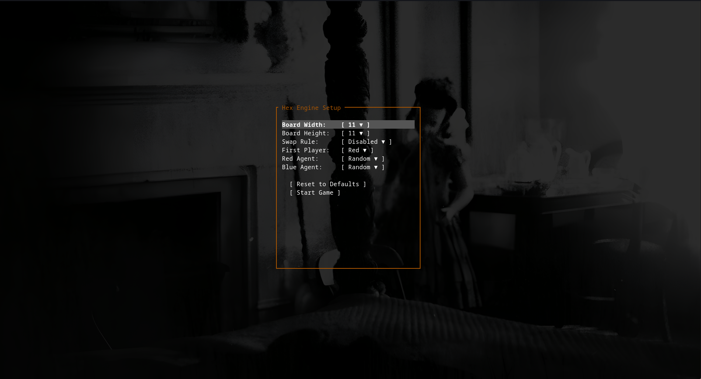
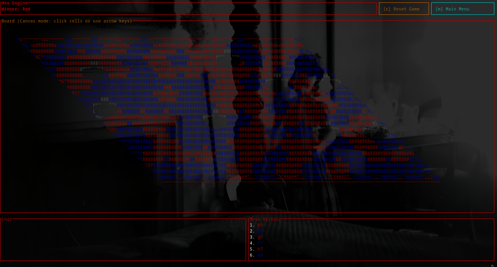

# hex-rs

A terminal-based engine and environment for the board game **Hex**, written in Rust. It utilizes `ratatui` and `crossterm` to render a fully interactive hexagonal grid directly in your terminal, with support for mouse and keyboard controls.

Designed with extensibility in mind, `hex-rs` features a decoupled agent system that allows you to easily plug in your own AI, bots, or custom players and pit them against humans or each other.


*(Placeholder: Main Menu Screenshot)*


*(Placeholder: Gameplay Screenshot)*

## Features

* **Terminal UI:** Beautifully rendered hexagonal grid using Ratatui's canvas and Braille characters.
* **Mouse & Keyboard Support:** Navigate the menu and play the game using your mouse (clicks, scrolling) or keyboard.
* **Configurable Match:** Customize board width, board height, the Pie Rule (Swap Rule), and the starting player. Configurations are automatically saved and loaded.
* **Extensible Agent Architecture:** Game logic runs on a separate thread. Players are implemented via an `Agent` trait. 
* **Built-in Agents:** Comes with a `Human` agent (mouse-click driven) and a `Random` agent (plays random valid moves with a slight delay).
* **Move History:** Scrollable log of all moves played in the current match.
* **Efficient Win Detection:** Uses a Union-Find (Disjoint Set) algorithm to efficiently detect winning connections across the board.

## Installation and Usage

Ensure you have Rust and Cargo installed. Then, clone the repository and run the project:

```bash
git clone <repository_url>
cd hex-rs
cargo run --release
```

## Controls

### Main Menu
* **Mouse:** Click to select options, open dropdowns, and change settings. Scroll to navigate dropdown menus.
* **Keyboard:** 
  * `Up` / `Down`: Navigate menu items.
  * `Enter`: Open a dropdown or apply a selection.
  * `Esc` / `q`: Close a dropdown or quit the game.

### Gameplay
* **Mouse:** 
  * Click on a valid empty hexagonal cell to place your piece (if playing as Human).
  * Click the `[r] Reset Game` or `[m] Main Menu` buttons.
  * Scroll inside the Move History panel to view past moves.
* **Keyboard:**
  * Arrow Keys: Move the board cursor.
  * `Enter`: Place a piece at the cursor's position.
  * `r`: Reset the current game.
  * `m`: Return to the main menu.
  * `q` / `Esc`: Quit the game.

## Creating Custom Agents

The engine is built to decouple the UI from the game logic. Agents do not need to worry about rendering or UI events.

### 1. Implement the `Agent` Trait

To create a new agent (e.g., a Minimax bot or a Neural Network), implement the `Agent` trait. Your agent only needs to provide a valid `HexMove` when `get_move` is called.

```rust
use crate::{Agent, HexBoard, HexMove};

pub struct MyCustomAgent;

impl Agent for MyCustomAgent {
    fn get_move(&mut self, board: &HexBoard) -> HexMove {
        // Implement your logic here...
        // Use board.is_valid_move(&m) to verify moves.
        HexMove { x: 0, y: 0 }
    }
}
```

### 2. Register the Agent

Once your agent is created, register it in `src/main.rs` within the `AVAILABLE_AGENTS` array. This will automatically make it available in the Main Menu dropdowns.

```rust
// src/main.rs

fn create_my_custom_agent(_rx: std::sync::Arc<std::sync::Mutex<Receiver<HexMove>>>) -> Box<dyn Agent> {
    Box::new(MyCustomAgent::new())
}

const AVAILABLE_AGENTS: &[(&str, AgentFactory)] = &[
    ("Human", create_human_agent),
    ("Random", create_random_agent),
    ("MyBot", create_my_custom_agent), // <- Add your agent here
];
```

That's it! You can now select `MyBot` from the menu for the Red or Blue player and watch it play.

## License

MIT License
